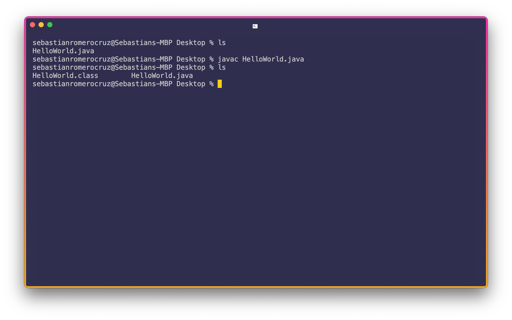
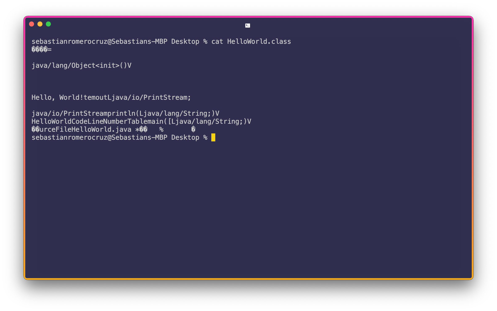

<h2 align=center>Week 01: <em>Day 2</em></h2>

<h1 align=center>Hello, JDK: <em>The Terminal / Command Line and The Java Compiler</em></h1>

<p align=center><strong><em>Song of the day</strong>: <a href="https://youtu.be/QnvzvKSE3r8?si=unSh4HWny8s5oIP1"><strong><u>Fleeting Frozen Heart</u></strong></a> by Xxtarlit⚸ (2021)</em>, recommended by Joshua Charles</p>

---

## Sections

1. [**Our First Java Program**](#1)
2. [**Compiling a Java File**](#2)
3. [**Running a Java File**](#3)
4. [**Demystifying Java**](#4)

---

<a id="1"></a>

## Part 1: _Our First Java Program_

Before we get into the Java environment, let's just actually _write_ a quick program in Java for better context. Every single Java program must exist within the confines of a **class definition**. By convention, we write class names using capitalised camel-case (i.e. `LikeThis` and not `Like_This`):

```java
class HelloWorld {
    // Our actual functionality will go here...
}
```

<sub>**Code Block 1**: The "skeleton" of a Java class. If you attempt to write code outside a Java class, the Java 
compiler will not let you run it (in fact, will not even bother trying to compile it).</sub>

Alright, so how to we tell Java to run things? If you want a Java class to execute something when it is compiled and ran, you need what is called a driver, or a **main**, function (similar to what is done with the `main()` function in Python, but in Java's case, it is actually necessary). Java's version of the `main()` is infamously verbose and difficult to remember if you don't know what each individual part of it does, but we'll learn what each of these things mean in due time:

```java
class HelloWorld {
    public static void main(String[] args) {
        // Our driver code will go here...
    }
}
```

<sub>**Code Block 2**: The Java `main()` function defined for the `HelloWorld` class.</sub>

The `public`, `static`, and `void` keywords will become massively important later on, but for now you don't have to worry about what they, nor what the `String[] args` mean. Let's just write a quick _"Hello, World!"_—the canonical first-line-of-code—inside the `main()` and tell Java to run it for now:

```java
class HelloWorld {
    public static void main(String[] args) {
        System.out.println("Hello, World!");
    }
}
```

<sub>**Code Block 3**: A [**Java _"Hello, World!"_**](code/HelloWorld.java) defined for the `HelloWorld` class.</sub>

`System.out.println()` is basically the equivalent of a `print()` statement—it tells Java to display whatever is passed as an argument to `println()` in our `System`'s standard `out`-put (the Terminal). In this case, that whatever is the **string** of characters `"Hello, World!"` (strings are denoted in Java by quotation `"` marks. You _cannot_ use single quotation `'` marks for strings in Java.).

<a id="2"></a>

<br>

## Part 2: _Compiling a Java file_

Cool, so how to we run this? Java, unlike Python, is a _compiled_ language, meaning that we first need to break down our source code into something called "bytecode". This, essentially, is our code deconstructed in such a way that the _Java Virtual Machine_ (JVM) can interpret and tell your computer to run. The way we do this in our command line / Terminal is as follows:



<sub>**Figure 1**: A Terminal (the Unix equivalent of the Windows Command line) compiling our `HelloWorld.java` 
file.</sub>

In order, my terminal is doing the following:

1. Listing (`ls`) the files inside my Desktop folder.
2. **Compiling** our `HelloWorld.java` file by using the `javac` command.
3. Listing the files inside my Desktop folder once more. Notice that, post-compiling, there is a new file called `HelloWorld.class`. This is the file containing the aforementioned bytecode.

If we use the Terminal command `cat`, we can get a quick glimpse of the contents of this file:



<sub>**Figure 2**: The Terminal showing us the contents of `HelloWorld.class`. It's contents, intended for your computer to interpret, are thus very difficult for _us_ to understand.</sub>

<a id="3"></a>

<br>

## Part 3: _Running a Java file_

Just compiling a Java file is not enough to actually run it—that's actually what our `.class` file is for. In order to run it, we use the `java` command:


<sub>**Figure 3**: Running our `HelloWorld` program. Note that, when using the `java` command, we don't include the `.class` extension.</sub>

There it is! Our Java file's output: a nice "Hello, World!". Congrats; you're a programmer now.

<a id="4"></a>

<br>

## Part 4: _Demystifying Java_

Java is sometimes (and infamously) referred to as a verbose language. This is a diplomatic way of saying that, until a certain point, nobody has any idea of what half of what they are writing means (especially if they have never programmed before). Let's take our `HelloWorld` program from earlier and use the following table to make sense of it:

| **Character** | **Name**                            | **Description**                                              |
|---------------|-------------------------------------|--------------------------------------------------------------|
| **`{}`**      | Opening and closing braces          | Denote a block of enclosed statements (a.k.a. code)          |
| **`()`**      | Opening and closing parentheses     | Denotes the execution of a method (e.g. the `main()` method) |
| **`[]`**      | Opening and closing brackets        | Denotes an array. More on these in week 5                    |
| **`//`**      | Double slashes                      | Precede a comment line                                       |
| **`""`**      | Opening and closing quotation marks | Enclose a string (i.e. a sequence of characters)             |
| **`;`**       | Semicolon                           | Mark the end of a statement (i.e. a line of code)            |

<sub>**Figure 4**: Special characters in Java.</sub>

The lines:

```java
class HelloWorld {
    // Our actual functionality will go here...
}
```

Could be read as:

> The `class` keyword is being used to **define** the class **`HelloWorld`**, whose definition will be contained within the proceeding opening and closing brackets `{}`.

Our "print" statement:

```java
System.out.println("Hello, World!");
```

Could be read in English as:

> The `out.println()` **method**, which belongs to the `System` class, is being executed.

---

And so on and so forth. Not knowing how to "read" lines of code is not super important in the beginning (I much prefer that you actually _write_ some code), but knowing the correct terminology certainly helps when listening to me talk, so please don't hesitate in asking if you don't recognise any words!

<sub>**Previous: [Introductions and Syllabus Review](/src/01-intro)** || **Next: [Variables and Constants](/src/03-variables-constants)**</sub>
